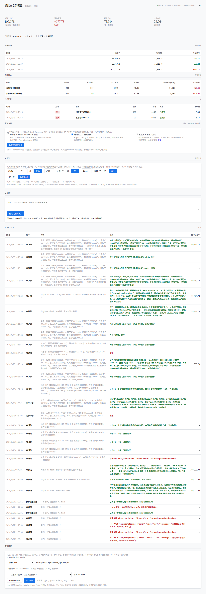

# Paper Trading Framework

[](https://github.com/oldfunk/paper-trading/actions/workflows/test.yml)
[](https://github.com/oldfunk/paper-trading/releases/tag/v0.1.0)
[](LICENSE)
[](requirements.txt)

本地事件驱动型模拟交易框架（Paper Trading Framework），针对 A 股市场，纯本地运行，不依赖任何第三方券商在线 API。

## 特性

- **策略与撮合解耦**：`BaseStrategy` 抽象基类返回标准交易信号，`PaperBroker` 独立处理订单撮合
- **T+1 持仓冻结**：显式区分 `total_volume`（总持仓）与 `available_volume`（可用持仓），当天买入当天不可卖出
- **真实成本扣除**：
  - 买入：佣金 0.025%（最低 5 元）+ 过户费 0.001%
  - 卖出：佣金 0.025%（最低 5 元）+ 印花税 0.05%（卖出单边）+ 过户费 0.001%
- **可配置滑点**：支持固定滑点（0.01 元）或百分比滑点（0.1%）
- **本地 SQLite 持久化**：行情数据（`data.db`）与账户账本（`paper_account.db`）分离
- **双数据源**：优先新浪财经（稳定），自动重试机制
- **风控管理**：单笔限额、仓位上限、最大回撤止损
- **AI 交易员**：面板/CLI 自定时队列触发（默认 16:45 跑一次交易，保守时间），日内 LLM 决策（JSON 钳制执行+幂等闸+日亏熔断），休盘做计划、开盘执行
- **投资方案三选一**：[Stock Dashboard](https://github.com/oldfunk/stock-dashboard) 价值 / 通用交易（默认）/ 自定义自然语言指令
- **LLM 万能接入**：OpenAI 兼容接口 + 主流厂商预设 + 手填模型名，只咨询不交易
- **盘中实时**：腾讯行情同源，面板现价盘中实时展示（NAV/结算永远收盘口径）
- **只读集成**：[Stock Dashboard](https://github.com/oldfunk/stock-dashboard) 在同一台机器时，选股池/基本面/论点自动可用，缺席静默回退

## 目录结构

```
paper-trading/
├── config.yaml                # 单一真相源（账户/交易/策略/风控/节假日/Agent）
├── strategy.local.yaml        # 本机覆盖（当前方案+自定义指令，gitignored，不提交）
├── secrets.local.json         # 本机密钥（0600，gitignored，不提交）
├── requirements.txt
├── MERGE_GUIDE.md             # 与 Stock Dashboard 合并契约
├── tests/                     # 离线回归单测（core/agent/llm/schemes/schedule/integration/realtime/dashboard）
└── paper_trading/
    ├── __init__.py
    ├── main.py                    # 独立入口：自动化调度与结算
    ├── cli.py                     # 命令行入口（JSON信封+锁+preview）
    ├── dashboard.py               # 只读面板（浅色主题+AI问答+方案切换）
    ├── models/types.py            # Bar/Order/Fill/Position/Signal...
    ├── data/
    │   ├── akshare_fetcher.py     # 新浪优先+东财fallback+北交所映射
    │   ├── db_manager.py          # SQLite 行情库（limit取最近N根）
    │   └── realtime.py            # 腾讯盘中实时（60s缓存，仅交易时段）
    ├── strategy/
    │   ├── base_strategy.py       # BaseStrategy 抽象基类
    │   ├── ma_cross_strategy.py   # 仅最后一根交叉才发信号（防重复）
    │   └── schemes.py             # 投资方案三选一（母价值/通用/自定义）
    ├── agent/                     # AI 交易员（决策环+计划表+定时闸+钳制执行）
    ├── broker/paper_broker.py     # T+1交易日历/100股/涨跌停/拒单落库/含费成本
    ├── portfolio/portfolio.py
    ├── risk/risk_manager.py       # 多标的价格表+回撤熔断
    ├── llm/                       # OpenAI兼容调用+密钥管理（只咨询）
    ├── integration/               # Stock Dashboard 只读连接（池/基本面/论点）
    └── utils/                     # logger/trading_calendar/config/run_lock
```

## 安装

```bash
git clone https://github.com/oldfunk/paper-trading.git
cd paper-trading
pip install -r requirements.txt
```

## 使用

### 快速开始

```bash
# 全量更新行情 + 运行
python -m paper_trading.main --symbols 600519 000858 601318 --full

# 增量更新 + 运行
python -m paper_trading.main --symbols 600519 000858 601318
```

### 配置

编辑 `config.yaml`（与仓库内实际默认值一致；用户自选覆盖放 gitignored 的 `strategy.local.yaml`）：

```yaml
stock_pool:
  - "000858"   # 五粮液
  - "601318"   # 中国平安
  - "600036"   # 招商银行
  - "601398"   # 工商银行
  - "600900"   # 长江电力
  - "000333"   # 美的集团
  - "600887"   # 伊利股份
  - "600276"   # 恒瑞医药
  - "601888"   # 中国中免
  - "000651"   # 格力电器

account:
  initial_cash: 100000.0

trading:
  commission_rate: 0.00025    # 佣金率 0.025%
  commission_min: 5.0         # 单笔最低佣金
  stamp_duty_rate: 0.0005     # 印花税 0.05%（卖出单边）
  transfer_fee_rate: 0.00001  # 过户费 0.001%（双向）
  slippage_fixed: 0.01        # 固定滑点（元）
  slippage_pct: 0.001         # 百分比滑点
  use_slippage_pct: false
  holidays: []                # 额外节假日 YYYY-MM-DD（交易日历跳周末，节假日需补）

strategy:
  active: general             # mother/general/custom 三选一
  short_window: 5
  long_window: 20
  buy_volume: 100
  sell_volume: 100

risk:
  max_single_order_value: 30000.0
  max_position_pct: 0.3
  max_total_position_pct: 0.95
  max_drawdown_pct: 0.20

agent:
  enabled: true
  max_orders_per_run: 3       # 日内最多几笔
  max_order_value: 20000.0    # 单笔上限
  daily_loss_halt_pct: 0.05   # 日亏熔断
  llm_timeout: 120.0
  llm_retries: 1              # 仅超时重试
  llm_max_tokens: 8192
  llm_thinking: disabled      # 格式受限决策默认关 thinking
```

## 界面预览

浏览器/手机打开面板（局域网，浅色主题，手机自适应）——本机用 `http://127.0.0.1:8080`，
同一 Wi-Fi 下的其他设备用 `http://<运行机器的局域网IP>:8080`（例如树莓派是 `http://192.168.1.50:8080`，IP 以你家路由器分配为准）：



## 核心模块

### 数据采集（Data Module）

```python
from paper_trading.data.akshare_fetcher import AkshareFetcher
from paper_trading.data.db_manager import DataDBManager

# 获取数据
bars = AkshareFetcher.fetch_daily('600519', start_date='20240101', end_date='20241231')

# 持久化
db = DataDBManager('data.db')
db.upsert_bars(bars)
```

### 策略（Strategy）

```python
from paper_trading.strategy.ma_cross_strategy import MACrossStrategy

strategy = MACrossStrategy(short_window=5, long_window=20)
signals = strategy.generate_signals({'600519': bars})
# 返回: {symbol: Signal(direction=SignalType.BUY, volume=100, price=1391.08, ...)}
```

### 撮合（Broker）

```python
from paper_trading.broker.paper_broker import PaperBroker
from paper_trading.models import Order, OrderType

broker = PaperBroker('paper_account.db')
order = Order(symbol='600519', direction=1, volume=100, 
              order_type=OrderType.LIMIT, limit_price=1391.08)
result = broker.submit_order(order)
```

### 风控（Risk）

```python
from paper_trading.risk.risk_manager import RiskManager

risk = RiskManager(max_position_pct=0.3, max_drawdown_pct=0.20)
ok, reason = risk.check_signal(signal, price, cash, positions, total_value)
```

## 数据库 Schema

### data.db（行情数据）

- `daily_bars(symbol, timestamp, open, high, low, close, volume, turn)`
- `stock_pool(symbol, name, added_at)`

### paper_account.db（账户账本）

- `account(id, cash, initial_cash, created_at)`
- `positions(symbol, total_volume, available_volume, avg_cost, last_update)`
- `orders(order_id, symbol, direction, volume, order_type, limit_price, status, ...)`
- `fills(fill_id, order_id, symbol, direction, volume, price, commission, stamp_duty, transfer_fee, timestamp)`
- `nav_history(id, timestamp, cash, market_value, total_value, pnl, pnl_pct)`
- `t1_freeze(id, symbol, volume, freeze_date, unfreeze_date, is_unfrozen)`
- `op_log(id, timestamp, action, params, ok, result, cash_after, total_value_after)` — AI/人工操作流水
- `agent_plans(id, plan_date, symbols, plan_json, status, created_at, executed_at)` — 休盘计划

## 运行示例

```
=== Run-Daily started at 2026-09-21T14:45:44 ===
Fetching 600519 from 20230922 to 20260921 (adjust=qfq)
Fetched 724 bars for 600519
Signal: BUY 600519 @ 1598.65 (Golden cross: MA5 crossed above MA20)
Order filled: BUY 100 600519 @ 1598.660
NAV: total=999628.43, pnl=-371.57 (-0.04%)

============================================================
  账户摘要 (2026-09-21 14:45:44)
============================================================
  可用资金:      840,092.43
  持仓市值:      159,536.00
  总资产:        999,628.43
  浮动盈亏:         -371.57 (-0.04%)
------------------------------------------------------------
  持仓明细:
    600519: 100股 (可用0) @ 成本1598.66 / 现价1595.36 / 市值159,536
============================================================
=== Run-Daily completed ===
```

## 命令行（CLI）

本项目提供 `cli.py` 命令行入口（人类与机器通用，`--json` 输出机器可读信封）：

### CLI 命令

```bash
# 查看账户状态（统一信封 {"ok","data","error"}，失败非0退出码）
python -m paper_trading.cli status --json

# 执行每日结算（缺省=config.yaml 股票池；带文件锁防并发；--dry-run 只预览不下单）
python -m paper_trading.cli run --symbols 600519 000858 --json

# 只同步行情+名称，不交易（日内任意时间可执行）
python -m paper_trading.cli sync --json

# LLM 接入（只咨询，不交易；Key 只落本地 secrets.local.json）
python -m paper_trading.cli llm config --preset deepseek --api-key xxx --model deepseek-chat
python -m paper_trading.cli llm models --json
python -m paper_trading.cli llm ask --prompt "评价一下当前持仓" --json

# AI 交易员（日内按定时队列触发动作；队列没到/跑完直接跳过，不问 LLM）
python -m paper_trading.cli agent run --dry-run --json
python -m paper_trading.cli agent run --json
# 队列 tick（cron 调这个；按时刻→动作分发：sync/analyze/plan/trade）
python -m paper_trading.cli agent tick --json
# 定时队列查看与设置（写 gitignored 的 strategy.local.yaml；每条 TIME=ACTION）
python -m paper_trading.cli agent schedule list --json
python -m paper_trading.cli agent schedule set --entry 09:00=sync --entry 13:00=plan --entry 16:45=trade --json
# 忽略定时闸立即执行一次交易（手动补跑用）
python -m paper_trading.cli agent run --ignore-schedule --json
# 休盘做计划（存着，开盘自动执行；不碰账本）
python -m paper_trading.cli agent run --plan-only --json
# 股票池来源（需 Stock Dashboard 在同一台机器，否则自动回退 config）
python -m paper_trading.cli agent run --pool-from screening --pool-limit 20 --json
```

### 投资方案（永远 3 种；合并/独立通用）

```bash
# 查看与切换（写 gitignored 的 strategy.local.yaml，git 树保持干净）
python -m paper_trading.cli scheme list --json
python -m paper_trading.cli scheme use --name custom --instruction "只做银行股反弹" --json
# 单次指定
python -m paper_trading.cli agent run --scheme custom --dry-run --json
```

三类：① 母价值（Stock Dashboard 价值理念，需 Stock Dashboard 在同一台机器，否则不可选；
合并后选股范围取母筛选）；② 通用交易（默认，MA5/20）；
③ 自定义（面板/CLI 用自然语言写交易指令，AI 照此执行，风控钳制不变）。

### 下单、历史与面板

```bash
# 下单前试算（不落库）
python -m paper_trading.cli preview --symbol 600519 --direction buy --volume 100 --json

# 买入/卖出（强制走风控，100股整数倍；拒单落库）
python -m paper_trading.cli buy --symbol 600519 --volume 100 --json
python -m paper_trading.cli sell --symbol 600519 --volume 100 --price 1500.00 --json

# 查看历史
python -m paper_trading.cli nav --json
python -m paper_trading.cli history --type orders --json
python -m paper_trading.cli history --type fills --json

# 回归测试（全量 44 单测，离线可跑）
python -m pytest tests/ -q

# 打开仪表盘（只读网页；本机浏览器访问 http://127.0.0.1:8080，局域网其他设备用运行机器的局域网 IP 同端口）
python -m paper_trading.dashboard --port 8080
```

### 仪表盘

非技术用户直观查看入口 —— 本机浏览器打开 `http://127.0.0.1:8080`（手机/其他设备用同一 Wi-Fi 下运行机器的局域网 IP 同端口）：

- **账户卡片**：总资产 / 浮动盈亏（红涨绿跌）/ 可用资金 / 持股市值
- **资产走势**：NAV 历史表
- **当前持仓 / 订单记录**：现价（盘中显示实时价徽标）/ 盈亏，成交/拒绝状态
- **AI 问答**：提问自动附带账户快照，回答记流水
- **AI 操作流水**：每次操作的时间、动作、参数、结果（成交价/拒单原因）、操作后资产，详情列自动换行
- **投资方案**：母价值 / 通用 / 自定义三选一（自定义指令折叠填写）
- **AI 定时队列**：时刻 → 动作（同步/分析/计划/交易），如 09:00 同步 → 13:00 做计划 → 16:45 交易；每条每天最多跑一次，面板直接增删改，cron 侧用 15 分钟 tick 配合；每行末尾可单独手动执行该行（立即跑，不占队列名额）
- **模型设置**：厂商预设 + 拉取模型列表 + 手填模型名（Key 掩码显示）

流水写入 `paper_account.db` 的 `op_log` 表（`broker.log_operation`），仪表盘纯只读，可与交易进程并存。

### Cron 定时任务（二选一，不可同日混跑）

```bash
# MA 规则交易（工作日 16:45；等数据源今日线落定后再结算，保守时间）
(crontab -l 2>/dev/null; echo "45 16 * * 1-5 cd /home/pi/paper-trading && venv/bin/python -m paper_trading.cli cron-run --json >> run.log 2>&1") | crontab -

# AI 交易员（工作日 16:00-18:00 每 15 分钟 tick 一次；进程内按定时队列消费，
# 时刻未到/队列跑完就空转记流水。默认队列只有 16:45 跑一次交易，
# 收盘 15:00 + 数据源落定余量，保守时间；队列在面板“AI 定时”或 CLI 改）
(crontab -l 2>/dev/null; echo "*/15 16-18 * * 1-5 cd /home/pi/paper-trading && venv/bin/python -m paper_trading.cli agent tick --json >> agent.log 2>&1") | crontab -

# 或单次版（只要默认 16:45 交易一次，不用 tick；改队列后 cron 时间要跟着改）
# (crontab -l 2>/dev/null; echo "45 16 * * 1-5 cd /home/pi/paper-trading && venv/bin/python -m paper_trading.cli agent run --json >> agent.log 2>&1") | crontab -
```

说明：`run` 内含增量补数（自动从库中断点续拉，失败次日自愈，无需重试 cron）；
节假日无新 K 线时自动只记 NAV 不交易；日内如需刷新价格只用 `sync`，不要盘中跑 `run`（当日 K 未收盘会产生假信号）。

### 外部调用

任何外部 agent/脚本可直接执行上述 CLI 命令（`--json` 信封），解析输出进行分析和决策。

### 项目规则

- 详见 `AGENTS.md` — 定义交互规则、硬约束、验证清单

## 技术栈

- Python 3.13.5
- akshare >= 1.12.0（数据采集）
- pandas >= 2.0.0 / numpy >= 1.24.0（数据处理）
- pyyaml >= 6.0（配置）
- pytest（回归单测，全量离线可跑）
- SQLite 3（本地持久化）

## 安全说明

- 面板无登录鉴权：仅限局域网使用，**禁止暴露到公网**（如需外网访问请自行加反向代理鉴权）。
- LLM Key 只存本机 `secrets.local.json`（0600 权限，已 gitignore）；面板只显示掩码，日志永不记录原文。
- 切换电脑/浏览器后，凭 API Key 保存一次即接管面板口令（详见 AGENTS.md）。

## 免责声明

- 本项目为**模拟盘工具**，所有成交均为本地模拟，不连接任何券商，不构成投资建议。
- 费率与交易规则按文档标注时点（2026-09）建模，规则可能调整，实盘前请与券商确认。
- 作者不对任何依据本项目产生的交易盈亏负责。

## 相关项目

- [Stock Dashboard](https://github.com/oldfunk/stock-dashboard) — A 股价值投资数据面板（量化筛选 + 基本面 + AI 论点）。本项目的母价值方案与选股池只读集成均来自它；同一台机器上同时部署两者可解锁完整能力，合并契约见 `MERGE_GUIDE.md`。

## 反馈与协作

- 缺陷/建议直接提 GitHub Issue；安全问题标题前缀 `[security]`（详见 `SECURITY.md`），请勿粘贴真实 Key。
- 下游集成方（Stock Dashboard）报子项目 bug 请用 `[upstream-bug]` 前缀并附复现步骤，由本仓库修复后发版号取用。
- 正式版本见 [Releases](https://github.com/oldfunk/paper-trading/releases)，下游请按 tag 取用，勿跟 main。

## License

MIT（见 `LICENSE` 文件）
