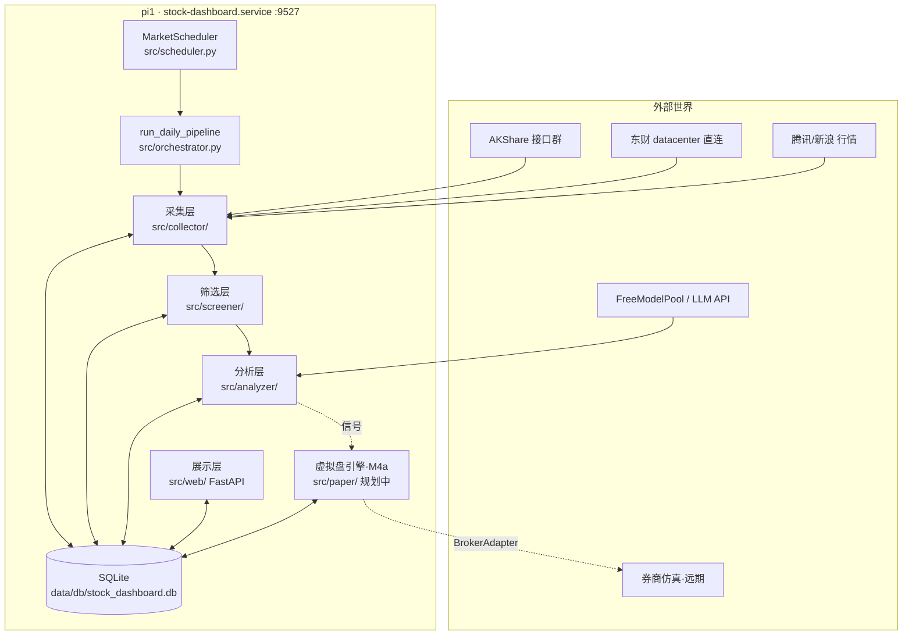
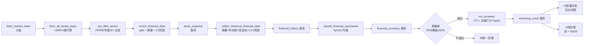

# Stock Dashboard — 系统架构

> 创建：2026-09-12 · 地位：架构真相源（与 `iteration-log.md` 同级，`roadmap.md` / `paper-trading.md` 的上游依据）
> 改本系统前先读本文件。模块边界变更必须同步更新本文件 + 对应单测。

## 1. 系统结构图

## 2. 每日数据流水线（15:30，工作日）

周六追加：`WatchlistReviewer.review()`（5 条硬规则 + LLM 决议 → `ai_watchlist` / `ai_journal`）。

## 3. 模块边界（跨层调用禁令）

| 模块 | 职责 | 允许调用 | 禁止 |
|---|---|---|---|
| `collector/` | 原始数据抓取 + 落库前清洗 | `models/`（DAO） | 不得做打分/决策；不得直写展示字段 |
| `screener/` | 7 门 + 豁免 + 五维打分 | `models/`（只读 summary/snapshot） | 不得调 AKShare；不得调 LLM |
| `analyzer/` | prompt + 模型池 + 纪律 enforcement | `models/`（读写分析表） | 不得改筛选分数；不得直连行情接口 |
| `scheduler.py` | 定时触发 + 并发 guard | `orchestrator` / `analyzer` | 不得含业务逻辑（只做触发 + 防重入） |
| `orchestrator.py` | 流水线编排 + 锁 | 各层入口函数 | 不得含采集/打分细节 |
| `web/routes.py` | 读库 + enrich + 渲染 | DAO + `_enrich_stocks()` | 不得调 AKShare/LLM（`onboard` 后台线程除外） |
| `paper/`（规划） | 信号→模拟委托→持仓→绩效 | DAO（读信号/K线，写 paper_* 表） | 不得碰真实资金接口；实盘只能经 BrokerAdapter + 人工闸 |

## 4. 数据表清单（现状）

| 表 | 写者 | 读者 | 说明 |
|---|---|---|---|
| `market_index` | 采集 | 首页 | 大盘指数，保留 30 天 |
| `stock_snapshot` | 采集/onboard | 全站 | 当日快照：行情 + 基础财务 |
| `financial_history` | 采集 | 汇总重建/详情页 | 年报明细（摘要+利润+现金流合并） |
| `financial_summary` | 重建 | 筛选/AI prompt | 5y/10y 均值（ROE/毛利/FCF/ROIC…） |
| `screening_result` | 筛选 | 候选页/AI/池 | 每轮 Top + AI 分析回写列 |
| `stock_analysis_history` | 分析 | 时间线/复盘 | 每次 AI 分析快照 |
| `ai_analysis_log` | 分析 | 成本统计 | token 用量 |
| `ai_watchlist` | 周复盘 | 首页 | 当前 5 只池股 |
| `ai_watchlist_history` | 周复盘 | 变更追踪 | 每次调仓记录 |
| `ai_journal` | 周复盘 | 笔记页 | 复盘纪要 |
| `watchlist` | 用户钉选 | 钉选 tab | 用户手工池 |
| `kline_daily` | 调度 | K 线图/纸盘 | 日 K（池 + Top25） |
| `run_log` | 编排 | 状态栏 | 每轮运行状态 |
| `deep_research` | 无（遗留） | 无 | 废弃表，勿依赖，待迁移删除 |
| `paper_*` | 虚拟盘（规划） | 纸盘页 | 见 `paper-trading.md` |

## 5. 数据源适配层规范（防 AKShare 式遗失）

> 事故教训：`stock_profit_sheet_by_report_em` / `stock_cash_flow_sheet_by_report_em` 在迭代中静默失效（`'NoneType' object is not subscriptable`），历史原因是"换了写法，旧兜底被删"。根治办法不是记住，而是让删除变得不可能不被发现。

### 5.1 Source Registry（注册表）

`src/collector/akshare_fetcher.py` 内的数据源必须在此登记，缺一不可：

| # | 数据源 | 函数 | 状态 | 兜底链 |
|---|---|---|---|---|
| S1 | 腾讯批量行情 | `fetch_tencent_batch` | 主用 | 新浪 → AKShare + 自算 |
| S2 | 业绩报表 | `stock_yjbb_em` 经 `_find_latest_yjbb_date` | 主用 | C2 东财直连 `_fetch_eastmoney_direct` |
| S3 | 财务摘要 | `stock_financial_abstract_ths`（并发+7天缓存） | 主用 | 无（失败即缺数，`onboard` 重试） |
| S4 | 利润表 | `stock_profit_sheet_by_report_em` | **已挂** | C2.5 东财 `_fetch_eastmoney_roic_fcf` |
| S5 | 现金流表 | `stock_cash_flow_sheet_by_report_em` | **已挂** | C2.5 东财 `_fetch_eastmoney_roic_fcf` |
| S6 | 指数/个股 K 线 | `stock_zh_index_daily` / `fetch_kline_data` | 主用 | 东财→腾讯回退 |
| S7 | 实时 tick（调度缓存） | `_poll_stocks` → `_realtime_cache` | 主用 | `fetch_stock_realtime` 按需拉 |

### 5.2 三条铁律

1. **删适配函数 = 删注册表行 + 删契约单测，三者同 commit，缺一驳回。** Hermes 自动迭代触碰 `collector/` 时必须先读本节。
2. **每个 S# 必须有一个 mock 契约单测**（不断网可跑）：断言返回字段集合不变。字段增减必须同步改注册表 + 下游（screener/prompt/模板）。
3. **新增数据源先登记 S# 再写代码**，兜底链写明"无"时必须给出重试/降级策略（参考 `onboard_stock` 三段降级）。

### 5.3 回归门禁（合并前必查）

- 全仓 `pytest` 零失败（当前基线 221+ passed，基线只升不降）。
- `collector/` / `screener/` / `analyzer/` 任一改动必须附带单测。
- 破坏性变更三问（写进 commit message）：删了哪个 S#？兜底是否覆盖？契约单测是否同步？
- pi1 只接受 `main` 分支部署；Hermes 只提交 GitHub 不部署（见 iteration-log 约束）。

## 6. 架构演进方向

- M4a 自研虚拟盘（`src/paper/`，零新依赖，跑 pi）→ 详见 `paper-trading.md`
- M4b QLib 离线研究（PC/云，不进 pi）→ 详见 `paper-trading.md`
- M4c 券商仿真（QMT 模拟模式 / PTrade 仿真，需 Windows + 券商账户）→ 详见 `paper-trading.md`
- 展示层：股票 UI 单模板 `_stock_list.html`（2026-09-12 曾统一后回退，原因见 commit 939b039；再动前先读该 commit 说明 + 本文件第 3 节）
