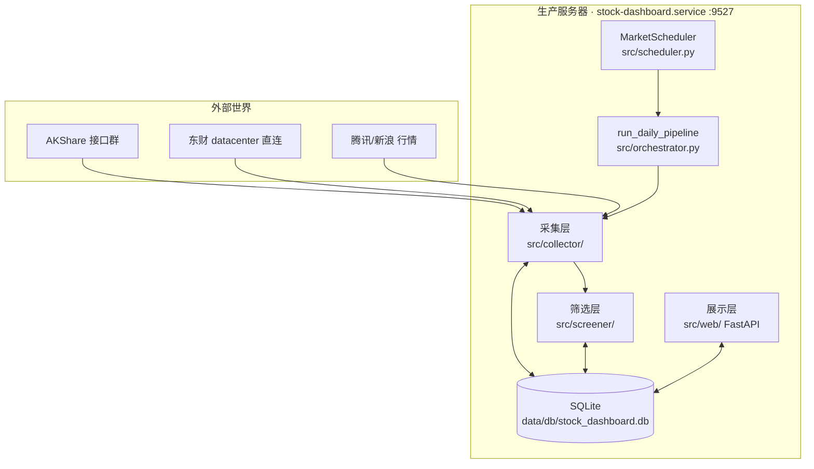

# Stock Dashboard — 系统架构

> 创建：2026-09-12 · 地位：架构真相源（与 `iteration-log.md` 同级，`roadmap.md` 的上游依据）
> 改本系统前先读本文件。模块边界变更必须同步更新本文件 + 对应单测。

## 1. 系统结构图

## 2. 每日数据流水线（15:30，工作日）

```mermaid
flowchart LR
    A[fetch_market_index<br/>大盘] --> B[fetch_all_stocks_basic<br/>~5500 A股行情]
    B --> C[pre_filter_stocks<br/>PE/PB/市值/ST 过滤]
    C --> D[enrich_financial_data<br/>yjbb + 摘要 + C2兜底]
    D --> E[stock_snapshot<br/>落库]
    E --> F[collect_historical_financial_data<br/>摘要+利润表+现金流+C2.5兜底]
    F --> G[financial_history 落库]
    G --> H[rebuild_financial_summaries<br/>5y/10y 均值]
    H --> I[financial_summary 落库]
    I --> J{质量闸<br/>ROE覆盖≥50%}
    J -->|通过| K[run_screener<br/>7门 + 五维打分 Top20]
    J -->|不通过| Z[中断 + 告警]
    K --> L[screening_result 落库]
    L --> N[K线拉取<br/>池 + Top25]
```

AI 分析用用户自带 Key（`/llm` 页配置 + 面板队列执行），面板只负责展示数据与 AI 笔记、列表卡片不再内联 AI 分析。周六复盘由 `WatchlistReviewer.review()` 触发（硬规则 + 监控条件本地执行；LLM 决议已随用户 Key 具备调用条件，待 10-03 周六首验 → `ai_watchlist` / `ai_journal`）。

## 3. 模块边界（跨层调用禁令）

| 模块 | 职责 | 允许调用 | 禁止 |
|---|---|---|---|
| `collector/` | 原始数据抓取 + 落库前清洗 | `models/`（DAO） | 不得做打分/决策；不得直写展示字段 |
| `screener/` | 7 门 + 豁免 + 五维打分 | `models/`（只读 summary/snapshot） | 不得调 AKShare；不得调 LLM |
| `analyzer/` | 本地分析（pipeline 已停用触发；手动脚本可用） | `models/` | 不得被 pipeline 调用 LLM |
| `scheduler.py` | 定时触发 + 并发 guard | `orchestrator` | 不得含业务逻辑（只做触发 + 防重入）；不得触发本地 AI 分析 |
| `orchestrator.py` | 流水线编排 + 锁 | 各层入口函数 | 不得含采集/打分细节 |
| `web/routes.py` | 读库 + enrich + 渲染 | DAO + `_enrich_stocks()` | 不得调 AKShare/LLM（`onboard` 后台线程除外）；列表卡片不得内联 AI 分析 |
| `paper_trading/` | 子项目全量合并树（subtree 机制，原生页面独立运行） | 母库只读（screening/watchlist/快照/AI 历史）、我们的 LLM Key | vendored 运行 CWD 须为该目录；上游漂移则以后 pull 冲突 |

## 4. 数据表清单（现状）

| 表 | 写者 | 读者 | 说明 |
|---|---|---|---|
| `market_index` | 采集 | 首页 | 大盘指数，保留 30 天 |
| `stock_snapshot` | 采集/onboard | 全站 | 当日快照：行情 + 基础财务 |
| `financial_history` | 采集 | 汇总重建/详情页 | 年报明细（摘要+利润+现金流合并） |
| `financial_summary` | 重建 | 筛选/详情页 | 5y/10y 均值（ROE/毛利/FCF/ROIC…） |
| `screening_result` | 筛选 | 候选页/池 | 每轮 Top + AI 分析回写列 |
| `stock_analysis_history` | 自带 Key 分析 + 外部写回兼容 | 时间线/复盘 | 每次 AI 分析快照 |
| `ai_analysis_log` | 自带 Key 分析（用量记账） + 外部写回兼容 | 成本统计 | token 用量 |
| `ai_watchlist` | 周复盘 | 首页 | 当前 5 只池股 |
| `ai_watchlist_history` | 周复盘 | 变更追踪 | 每次调仓记录 |
| `ai_journal` | 周复盘 | 笔记页 | 复盘纪要 |
| `watchlist` | 用户钉选 | 钉选 tab | 用户手工池 |
| `kline_daily` | 调度 | K 线图 | 日 K（池 + Top25） |
| `run_log` | 编排 | 状态栏 | 每轮运行状态 |
| `deep_research` | —（已删除） | 无 | 2026-09-23 用户批准删除，5 行已备份，勿重建 |

## 5. 数据源适配层规范（防 AKShare 式遗失）

> 事故教训：`stock_profit_sheet_by_report_em` / `stock_cash_flow_sheet_by_report_em` 在迭代中静默失效（`'NoneType' object is not subscriptable`），历史原因是"换了写法，旧兜底被删"。根治办法不是记住，而是让删除变得不可能不被发现。

### 5.1 Source Registry（注册表）

`src/collector/akshare_fetcher.py` 内的数据源必须在此登记，缺一不可：

| # | 数据源 | 函数 | 状态 | 兜底链 |
|---|---|---|---|---|
| S1 | 腾讯批量行情 | `fetch_tencent_batch` | 主用 | 新浪 → AKShare + 自算 |
| S2 | 业绩报表 | `stock_yjbb_em` 经 `_find_latest_yjbb_date` | 主用 | C2 东财直连 `_fetch_eastmoney_direct` |
| S3 | 财务摘要 | `stock_financial_abstract_ths`（并发+7天缓存） | 主用 | 无（失败即缺数，`onboard` 重试） |
| S4 | 利润表 | `stock_profit_sheet_by_report_em` | **已挂** | C2.5 东财 `_fetch_eastmoney_roic_fcf` |
| S5 | 现金流表 | `stock_cash_flow_sheet_by_report_em` | **已挂** | C2.5 东财 `_fetch_eastmoney_roic_fcf` |
| S6 | 指数/个股 K 线 | `stock_zh_index_daily` / `fetch_kline_data` | 主用 | 东财→腾讯回退 |
| S7 | 实时 tick（调度缓存） | `_poll_stocks` → `_realtime_cache` | 主用 | `fetch_stock_realtime` 按需拉 |
| S8 | 行业分类（新浪 49 板块） | 新浪直连 `newSinaHy` + `getHQNodeData`（`_fetch_sector_map_impl`） | 主用 | 上次成功磁盘缓存 → `{}` 跳过回填（不清旧值） |

### 5.2 三条铁律

1. **删适配函数 = 删注册表行 + 删契约单测，三者同 commit，缺一驳回。** 自动迭代触碰 `collector/` 时必须先读本节。
2. **每个 S# 必须有一个 mock 契约单测**（不断网可跑）：断言返回字段集合不变。字段增减必须同步改注册表 + 下游（screener/prompt/模板）。
3. **新增数据源先登记 S# 再写代码**，兜底链写明"无"时必须给出重试/降级策略（参考 `onboard_stock` 三段降级）。

### 5.3 回归门禁（合并前必查）

- 全仓 `pytest` 零失败（当前基线 468 passed，2026-09-28 生产服务器 worktree gate 实测；基线只升不降）。
- `collector/` / `screener/` 任一改动必须附带单测。
- 破坏性变更三问（写进 commit message）：删了哪个 S#？兜底是否覆盖？契约单测是否同步？
- 生产服务器只接受 `main` 分支部署；开发侧只提交 GitHub，不直连生产改动（生产从 origin 拉取，见 iteration-log 约束）。

## 6. 架构演进方向

- **P1 面板深化**（目标 11 月）：评分体系透明化、AI 笔记增强、时间线交互、详情页体验优化
- **P2 体验优化**（目标 12 月）：移动端适配、快捷切换、财务指标高亮、搜索排序
- **AI 分析**：用用户自带 Key（`/llm` 配置 + 队列执行），面板只负责展示数据与 AI 笔记
- **已删除**：`src/analyzer/` 保留（本地触发已停用，仅手动脚本可用；原 `src/paper/` M4a 已删，见下）
- **量化交易系统**：M4a/原生包已归档；2026-09-29 起由 M6 全量合并接替（顶层 `paper_trading/` + `/paper` 嵌原面板；Universe 走母筛选 + AI 用我们的 Key；:8081 面板独立服务）

## 7. 方法论与内化避坑（2026-09-22 定稿）

门规、豁免、五维评分、分析纪律均为本项目自有实现（价值投资通用原则的本地化），不依赖、不镜像任何外部项目；历史镜像与对照计划已删除（git 历史可查）。

**两阶段方向相反是分工，不是矛盾**：筛选是漏斗，宁可漏网不可误杀；决策是闸门，宁可错过不可做错。两处规则必须保持口径分离，不得互相"修正"。

**内化避坑清单（硬约束）**：
1. 禁止硬编码倍数评分表（如"ROE>15% 优秀/20% 卓越"式查表打分）——评分用连续分制，阈值只做门规与豁免判断
2. 禁止多 agent 角色扮演"独立视角"——同源模型互相当独立视角是假验证；分析采用单 prompt 结构化输出
3. 每条豁免写成通用条件组合，禁止绑定明星案例（美团/亚马逊/Costco 式锚定不得进规则）
4. 数据源规范只写适配器接口与验收（见 §5），不写死上游 URL 清单
5. 结构化输出模板必须配"具体结论而非空话"要求（假设须带验证方式与频率，触发红线须给证据），防止填空式八股
6. 一切分析落库（论文/假设状态/复盘笔记），禁止"生成 .md 即终点"的一次性报告
7. 输出格式禁装饰性要求（"呼应大师名言"式），只允许信息性结构
8. prompt 每个关键输入附来源与 asof 日期，缺失/兜底字段显式标注（见 `_data_quality_*`），不得当精确值引用

**已内化的对照能力**（均在本仓实现，无外部依赖）：门规+豁免+五维评分（`src/screener/value_screener.py`）、估值/终值验算闸（`scripts/verify_valuation.py` / `verify_intrinsic.py`）、双源误差标记进 AI 数据质量（`_attach_batch_context` + `_data_quality_text`）、六关 Checklist+镜子测试+否决红线+反面检验（`ANALYSIS_PROMPT`）、论文假设追踪与复盘写回（`watchlist_thesis` 表 + `WatchlistThesisDAO` + 复盘 `thesis_updates`）、周复盘三问（`_build_prompt`）。
