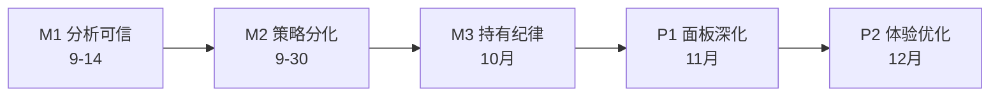

# 开发总路线

> 起始：2026-09-12 · 上游：`architecture.md` · 账本：`iteration-log.md`
> 本文件是全项目路线总入口。下面"总路线"是方向，下面各"子路线"是历史沉淀（原文保留）。

## 总路线：价值投资分析面板

- **M1 分析可信**（目标 9-14）：B1 验算 + B2 三态结论，每个候选估值可验算（见 iteration-log 目标框架）
- **M2 策略分化**（目标 9-30）：B3 + B4 + `strategies.yaml` 三策略（growth/dividend/turnaround）接入流水线，独立候选池
- **M3 持有纪律**（目标 10 月）：B5 论点漂移 + B6 + B7 + 钉选股监控条件提醒
- **P1 面板深化**（目标 11 月）：评分体系透明化、AI 笔记增强、时间线交互、详情页体验优化
- **P2 体验优化**（目标 12 月）：移动端适配、快捷切换、财务指标高亮、搜索排序

### 已完成阶段（归档）

- **M1 分析可信** ✅ 2026-09-14 完成
- **M2 策略分化** ✅ 2026-09-20 完成
- **M3 持有纪律** ✅ 2026-09-20 完成

### 已归档（不再开发）

- **M4a 自研虚拟盘** — 已删除（`src/paper/`、`paper.html`、纸盘测试均已删；git 历史可查，不再开发）
- **M4b QLib 离线验证** — 不再开发（`scripts/backtest_topk.py` 保留为历史产物，不纳入流水线）
- **M4c 券商仿真** — 不再开发
- **M4d 实盘预备** — 不再开发
- **AI 分析本地执行** — 本地触发已停用（scheduler 不再调用；`src/analyzer/` 保留供手动脚本使用），分析改由外部 AI 执行（协议见 `src/ai_proxy/`）

### 防回归门禁（AKShare 事故不再犯）

1. 数据源增删必须同步 `architecture.md` §5 注册表 + 契约单测，三者同 commit
2. 全仓 pytest 零失败（基线 317 passed，只升不降）
3. `collector/` `screener/` 改动必须附单测
4. Hermes 约束：只提交 GitHub 不部署 pi1；禁删 S1–S7 适配函数（除非替代 + 单测同到）

---

# 子路线：单股详情页迭代路线（原文保留）

> 起始：2026-07-22 · 最近重写：2026-07-23
> 基线：单股详情页 12 章节已上线（AI 笔记 + 动态财务历史横向滚动 + 时间线 + 在池状态），第 10 章节行情图表用 klinecharts 自研 K 线 + AI 交易信号标注。主页大盘点击弹出指数 K 线模态框。K 线统一空心样式（candle_stroke）。

## 已有数据底座

`src/collector/akshare_fetcher.py` 已接入：
- 实时行情（`stock_zh_a_spot`）
- 业绩报表（`stock_yjbb_em`）
- 财务摘要（`stock_financial_abstract_ths`）
- 利润表（`stock_profit_sheet_by_report_em`）
- 现金流表（`stock_cash_flow_sheet_by_report_em`）

## 行情图表策略

行情类内容**自研 klinecharts**（不再 iframe 嵌入第三方网站）：
- **个股 K 线**（详情页第 10 章节）：klinecharts + 日/周/月切换 + 技术指标（MA/VOL/MACD/KDJ/RSI 可开关）+ AI 交易信号标注
- **大盘指数 K 线**（主页）：点击大盘项弹出模态框，实时拉取指数日K（akshare `stock_zh_index_daily`，不缓存）
- **K 线样式**：统一 `candle_stroke` 空心蜡烛图（中国习惯：阳线空心红边框、阴线实心绿）
- klinecharts@9.8.12 本地引用（205KB），CDN 被 ORB 阻止必须本地化

**站内独有价值**：AI 笔记、评分体系、筛选策略、时间线、AI 交易信号标注。

## 设计模式约束（已固化到 project_memory）

- **宽表格**：横向滚动容器 + `width: max-content` + 第一列 `position: sticky` + `white-space: nowrap` + 父容器 `overflow-x: hidden`
- **多卡片 grid**：卡片 `min-width: 0; overflow: hidden` 防止撑开列宽
- **LLM JSON 字段**：写模板前必须查 DB 确认实际字段名
- **零依赖优先**：评分趋势用纯 SVG 生成，不引入前端库（除非确有必要，klinecharts 除外）
- **pi 性能**：数据定时缓存，非实时拉取；复杂渲染评估 CPU/内存负载
- **klinecharts 渲染**：`init()` 后容器必须可见且尺寸非零，否则 canvas 尺寸为 0 无法绘制（loadKline 只切换 loading/empty 状态，不隐藏 chart 容器）
- **klinecharts 指标 API**：`createIndicator(name, isStack, {id})` 副图返回 paneId，必须保存；`removeIndicator(paneId, name)` 才能正确删除，不能把 name 当 paneId 传
- **klinecharts 蜡烛图类型**：`candle_solid`（全实心）/ `candle_stroke`（全空心）/ `candle_up_stroke`（阳线空心阴线实心）/ `candle_down_stroke`（阳线实心阴线空心）。中国习惯用 `candle_up_stroke`

---

## P0 — 已完成 ✅

### ① 行情图表（klinecharts 自研 + AI 交易信号）✅
- **方案**：klinecharts@9.8.12 本地引用（205KB），非 iframe 嵌入
- **包含**：日/周/月 K 线 + 技术指标切换（MA/VOL/MACD/KDJ/RSI 可开关）+ AI 交易信号标注
- **AI 价值**：图表下方叠加 AI 分析的 Signal（买入/持有/回避）+ 买入区间 + 目标价 + 止损位 + 置信度
- **K 线样式**：`candle_up_stroke` 空心蜡烛图（中国习惯：阳线空心红边框、阴线实心绿）
- **主页联动**：大盘指数点击弹出 K 线模态框（日/周/月切换），实时拉取 akshare `stock_zh_index_daily`，不缓存
- **根因修复**：
  - loadKline 不再隐藏 chart 容器（原 display:none 导致 canvas 尺寸为 0，klinecharts 无法渲染）
  - 副图指标 `createIndicator` 返回的 paneId 必须保存，`removeIndicator(paneId, name)` 才能正确删除（原代码误把 name 当 paneId 导致 KDJ/MACD/RSI 关不掉）
- **状态**：已部署验证，K 线样式 + 指标开关 + 大盘弹窗均通过（2026-07-23）

---

## P1 — 面板深化（进行中）

### ② 评分体系透明化
- 当前：综合评分 0-100，但用户不知分数怎么来的
- 迭代：评分卡片点击展开，显示五大维度子分数 + 加权公式 + 与行业平均对比
- 依赖：现有评分逻辑

### ③ AI 笔记增强
- 当前：单条最新 AI 笔记
- 迭代：支持历史笔记对比（本周 vs 上周变化）、AI 自动检测"矛盾信号"（如 PE 下降但股价上涨）
- 依赖：现有 `ai_journal` 表

### ④ 时间线交互 ✅
- 当前：历次 AI 分析时间线纯文本
- 迭代：点击展开历史分析全文、评分变化曲线、关键事件标注（财报发布/分红/警示）
- **状态**：已实施点击展开 + Signal 标签 + 评分变化标注（↑↓ 箭头 + 差值），commit f93b456

---

## P2 — 体验优化

### ⑤ 详情页内"快捷切换股票"（上一只/下一只）
### ⑥ 财务指标同环比高亮（红绿）
### ⑦ 移动端适配（当前 max-width:900px 固定，iframe 高度需自适应）
### ⑧ 搜索结果支持按 PE/ROE/市值 排序

---

## 变更记录

| 日期 | 内容 | commit |
|---|---|---|
| 2026-09-20 | 路线调整：移除 M4a/M4b/M4c/M4d，聚焦面板功能优化 | - |
| 2026-09-12 | 总路线确立（M1–M4d）+ 防回归门禁 + 子路线归档 | - |
| 2026-07-22 | 文档创建 | cd82663 |
| 2026-07-22 | P0① K 线图 spec 完成 | cd82663 |
| 2026-07-22 | K 线图实施计划 | 68e8831 |
| 2026-07-23 | kline_daily 表 + KlineDAO | 3c5b4bd |
| 2026-07-23 | fetch_kline_data 采集方法 | 8f7b961 |
| 2026-07-23 | scheduler 每日追加 K 线拉取 | 418ca84 |
| 2026-07-23 | kline API + 周月聚合 | a13df0e |
| 2026-07-23 | 详情页 klinecharts K 线图组件 | c243775 |
| 2026-07-23 | 双数据源回退（东方财富→腾讯） | 91d45c1 |
| 2026-07-23 | klinecharts 本地化解决 ORB | 1c5b506 |
| 2026-07-23 | K线volume为None导致渲染失败修复 + 首页优化 | c9e8857 |
| 2026-07-23 | 非观察池股票点击跳转东方财富行情页 | 4851d24 |
| 2026-07-23 | **废弃自研 K 线，改 iframe 嵌入东方财富** | a0ae6ba |
| 2026-07-23 | P1② 时间线交互增强 + 修复 market_snapshot bug | f93b456 |
| 2026-07-23 | **恢复 klinecharts 自研 + AI 交易信号标注** | bd07242 |
| 2026-07-23 | 主页大盘改为自研 K 线弹窗 + 空心 K 线样式 | 8a2e610 |
| 2026-07-23 | roadmap 同步大盘弹窗 + 空心K线 + P1④ 已完成 | 11d176e |
| 2026-07-23 | fix: KDJ/MACD/RSI 指标关不掉 + 阴线变空心 | 145651a |

---

## 2026-08-02 修复：周六复盘洪水循环（已修复 ✅）

- **症状**：12 天无周复盘（ai_journal 停在 7/21）；ai_watchlist_history 被灌入 3282 条重复（7/25: 2760 + 8/1: 522）
- **根因**：watchlist_reviewer._validate_and_persist 用 MarketIndexDAO 未 import → NameError → 异常分支不设 _last_review_date → scheduler 每 30s 洪水重试
- **修复**（commit ae53094）：
  - _validate_and_persist 补 MarketIndexDAO import
  - scheduler 加 _review_in_progress 防并发标志
  - 异常分支也标记当日完成（防 30s 重试）
  - complete_run 成功/跳过路径不再误传 error 参数（原来成功复盘被标 failed）
- **数据清理**：history 3287→25 条（按 code+date 保留最新）；649 条僵尸 run 标记失败；review_count 重置为真实周数
- **验证**：手动复盘端到端通过（journal 写入、history 每池股 1 条、run_log completed）
- **观察期**：8/8、8/15 两次周六复盘正常跑，验证产出质量后再定迭代方向

---

## 2026-08-11 AI Berkshire 深度对齐（进行中）

> 依据 docs/superpowers/plans/2026-08-11-berkshire-deepening.md，逐阶段补全分析理论缺口，全部改动在 prompt + 模板层，不改流水线。

### 阶段 A：信息丰富度评级 A/B/C（已完成 ✅）
- **prompt**（ai_analyzer.py）：ANALYSIS_PROMPT 新增 info_richness 字段（grade A/B/C + basis），指导 C 级时估值标注受限 + confidence 不得超低
- **前端**（stock_detail.html）：新增 信息丰富度评级徽章区块（A 绿 / B 黄 / C 红 + 依据一句）
- **验证**（commit c5e2829）：000792 盐湖股份复跑，产出 grade=B + 完整依据；模型池轮换正常
- **状态**：已提交推送 main

### 阶段 B：六关 Checklist（已完成 ✅）
- **prompt**（ai_analyzer.py）：ANALYSIS_PROMPT 新增 checklist 六关字段（能力圈/好生意/护城河/管理层/安全边际/纪律，各 score 1-5 + note），指导 moat/management/margin_of_safety 必须与对应单块字段一致，任一关 ≤2 → signal 不得 BUY
- **前端**（stock_detail.html）：新增 六关 Checklist评分卡（3x2 网格，★评分 + 通过绿/警示红）
- **验证**（commit 9a03be6）：000792 盐湖股份复跑，六关全产出且与 moat_evaluation/management_score 一致，signal=AVOID 与低分吻合
- **状态**：已提交推送 main

### 阶段 C：真镜子测试（已完成 ✅）
- **prompt**（ai_analyzer.py）：ANALYSIS_PROMPT 新增 mirror_test 字段（5 句模板 statements + passed + missing），保留 mirror_counts 做转折词统计；指导 passed=false 时 signal 不得 BUY
- **前端**（stock_detail.html）：新增 镜子测试区块（5 句逐一显示 + 通过/未通过徽章 + 缺失句标红）
- **验证**（commit d74e652）：000792 盐湖股份复跑，5 句完整 passed=true，signal=AVOID 一致
- **状态**：已提交推送 main

### 阶段 D：快速否决红线（已完成 ✅）
- **prompt**（ai_analyzer.py）：ANALYSIS_PROMPT 新增 veto_checklist 8 条红线（说不清赚钱/连续负FCF/诚信污点/护城河不可逆侵蚀/博傻/无法承受归零/跟风/说不清买入理由）+ triggered_count，任一 true → signal 强制 AVOID
- **前端**（stock_detail.html）：新增 快速否决红线区块（8 条逐一显示 + 触发标红 + 计数徽章）
- **复盘联动**（watchlist_reviewer.py）：新增第 5 条硬规则 check_veto_triggered（triggered_count>=1 或任一红线 true → 强制调出观察池），5 个新单测
- **验证**（commit e9b27df + 18eda31）：000792 盐湖股份复跑，触发 3 条红线（连续负FCF/护城河侵蚀/说不清理由），signal=AVOID 一致；pytest 25 passed
- **状态**：已提交推送 main
